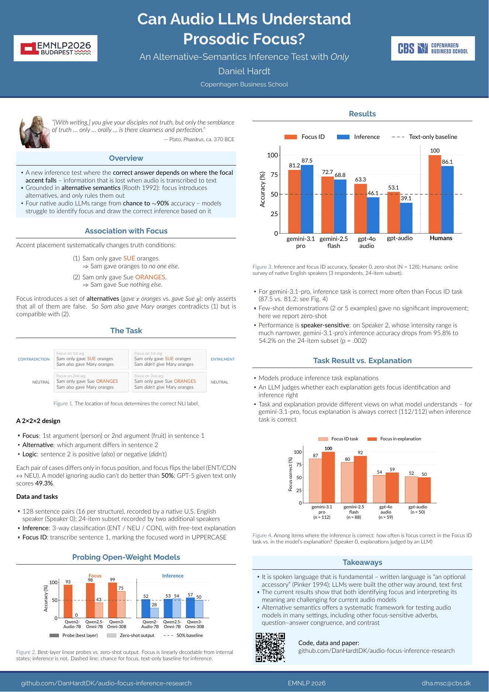

# Can Audio LLMs Understand Prosodic Focus?

### An Alternative-Semantics Inference Test with *Only*

**Daniel Hardt** · Copenhagen Business School · *Findings of EMNLP 2026*

[Poster (PDF)](docs/emnlp2026_poster.pdf) · Paper: coming soon in the ACL Anthology

<a href="docs/emnlp2026_poster.pdf"></a>

Where the accent falls changes what a sentence means:

> Sam only gave **SUE** oranges. ⇒ Sam gave oranges to *no one else*.\
> Sam only gave Sue **ORANGES**. ⇒ Sam gave Sue *nothing else*.

That difference is lost when speech is transcribed to text. This repository
contains an inference test built on it, using the alternative semantics of
focus (Rooth 1992), and the code and data used to evaluate audio LLMs on it.

## The task

The model hears sentence 1 and judges whether written sentence 2 is entailed,
contradicted or neither. The correct label depends only on which word is
focused:

| Sentence 1 (spoken) | Sentence 2 | Label |
|---|---|---|
| Sam only gave **SUE** oranges | Sam *also* gave Mary oranges | Contradiction |
| Sam only gave Sue **ORANGES** | Sam *also* gave Mary oranges | Neutral |
| Sam only gave **SUE** oranges | Sam *didn't* give Mary oranges | Entailment |
| Sam only gave Sue **ORANGES** | Sam *didn't* give Mary oranges | Neutral |

A model that ignores the audio can do no better than 50%; GPT-5 given the text
alone scores 49.3%. A second task, **Focus ID**, asks the model to transcribe
sentence 1 and mark the focused word.

The 128 items follow a 2×2×2 design (focus × alternative × logic) and were
recorded by a native U.S. English speaker, with a 24-item subset recorded by
two additional speakers.

## Key results

- Four native audio LLMs range from chance to about 90% accuracy:
  gemini-3.1-pro scores 87.5% on inference, while GPT-4o-audio and GPT-audio
  fall below the text-only baseline.
- For gemini-3.1-pro, the focus stated in its explanation is correct for every
  correctly answered inference item (112/112), more often than its Focus ID
  task answers suggest.
- Performance is speaker-sensitive: on a speaker with a much narrower
  intensity range, gemini-3.1-pro drops from 95.8% to 54.2% on the 24-item
  subset.
- Linear probes on open-weight Qwen models show focus is decodable from
  internal states, but the inference is not.

## Repository layout

| Path | Contents |
|------|----------|
| `code/audioInput.py` | Main Focus ID / inference pipeline (OpenAI and Gemini backends) |
| `code/judge_claude.py` | LLM-as-judge scoring of model explanations |
| `code/analyze_accuracy.py`, `code/inference_stats.py` | Significance tests (McNemar, exact binomial) |
| `code/speaker_acoustics.py` | Praat/parselmouth acoustic analysis of the recordings |
| `code/qwen/` | Qwen inference and layer-wise probing |
| `code/qualtrics_export/` | Human-survey build and scoring scripts ([README](code/qualtrics_export/README.md)) |
| `data/stimuli/` | Stimulus sets (JSON) and Qualtrics survey definitions |
| `data/speakers/` | Recordings: full sessions (`raw/`) and per-item clips (`clips/`) |
| `data/output/` | Model outputs (per-run and `master_*` CSVs, logs) used in the paper |
| `results/` | Statistical analysis write-ups |
| `docs/` | Poster, data organisation, recording protocol, survey construction, probing notes |

See [`docs/data_organisation.md`](docs/data_organisation.md) for the stimulus
format and file naming.

## Setup

Python 3.10+.

```bash
python -m venv .venv
source .venv/bin/activate   # Windows: .venv\Scripts\activate
pip install -r requirements.txt

export OPENAI_API_KEY=...
export GOOGLE_API_KEY=...
export ANTHROPIC_API_KEY=...   # judge_claude.py only
```

## Running

```bash
python code/audioInput.py f1 f2 --backend openai --model gpt-audio --mode audio
```

Inputs are stimulus file IDs (`f1`–`f13`, `ns1`–`ns3`), resolved against
`--wav-dir` (default `data/speakers/speaker0/raw`) and `--json-dir` (default
`data/stimuli`). Run `python code/audioInput.py --help` for all options
(few-shot, cross-validation, Gemini thinking settings).

For the Qwen models and probing, see [`commands.txt`](commands.txt).

## Citation

```bibtex
@inproceedings{hardt-2026-audio-llms-prosodic-focus,
  title     = {Can Audio {LLM}s Understand Prosodic Focus? An Alternative-Semantics Inference Test with \textit{Only}},
  author    = {Hardt, Daniel},
  booktitle = {Findings of the Association for Computational Linguistics: EMNLP 2026},
  year      = {2026}
}
```

## Contact

Daniel Hardt · dha.msc@cbs.dk
